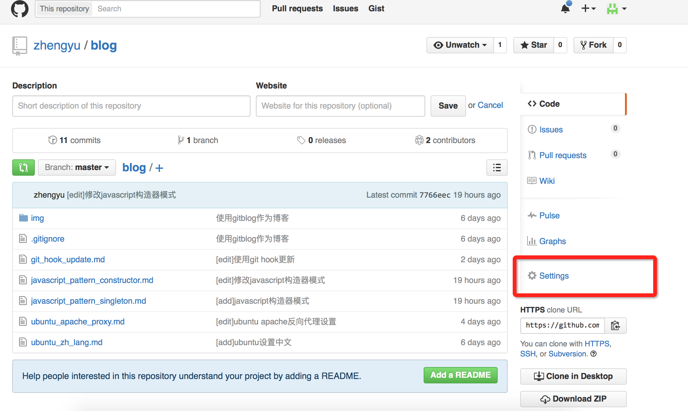
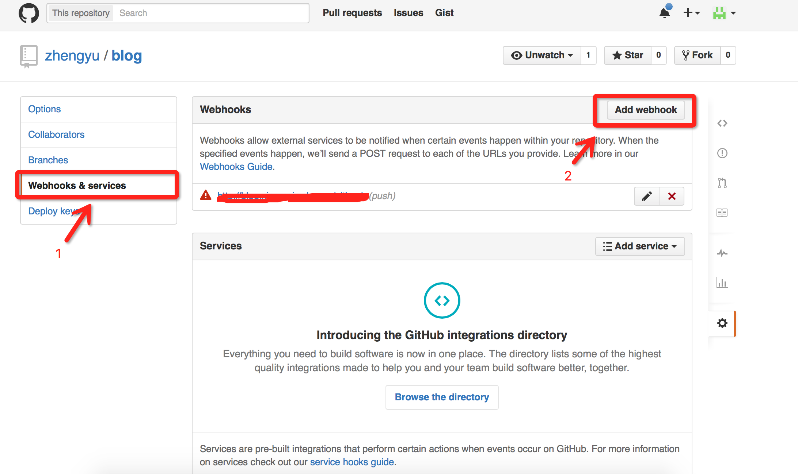

由于使用的是gitblog，那怎么能不用git呢，于是就将blog也放到git上了，每次在本地写好文章，然后```git push```上去，再ssh到服务器上```git pull```，虽然不算十分复杂，但是作为一个程序员，能自(tou)动(lan)就肯定不会手动，而且git也正好有个hook的机制可以让你对仓库做了动作的时候给你callback，于是本文就诞生了。

git hook
---

git hook是用户在作出一系列对git的操作后，git会自动调用的接口，简单来说就是，例如用户将代码push到服务器，然后服务器就会调用一个脚本。运用这个机制，我们就可以做一些自动化的操作，例如用户push后，服务器自动拉取最新的代码，或者发送邮件通知等等。我使用的是github，所以本文下本会重点介绍github的web hook。

实现方法
---

首先请确保你的项目git pull时不需要输入用户名密码等，可以直接拉取。

然后打开git项目首页，点击右下方的“Settings”



然后点击左边的“Webhooks & services”，就能进入webhook设置界面，然后点解右上方的“Add webhook”添加新的hook，这个hook为一个url地址，用户在对git操作后，github会调用这个url接口，实现相关功能。



设置完成后，进入服务器编辑上面的接口：

```php
//git_repo_dir 代指你的项目git init的目录，设置为绝对路径，例如：/var/www/test/
//1>&2 是为了如果git pull发生错误了，可以将错误信息显示出来
exec('cd git_repo_dir && git pull origin master 1>&2');
```

直接调用该接口试试，如果可以更新，那就不用看下面了。

提示文件夹不是一个git仓库，没有.git之类的
---

该问题通常是因为git_repo_dir没有设置到正确的目录，找到你当时git init的那个目录就可以，该目录下肯定会有.git这个文件夹

提示Permission问题
---

该问题通常是因为apache的用户没有权限使用git pull，解决方法是(apache默认用户名为www-data，具体请已你的系统为准)：

1. 使用```sudo -u www-data ssh-keygen -t rsa```，使用www-data用户创建ssh公钥和私钥，通常保存在wwww/.ssh目录下，进入该目录，查看公钥，并将公钥复制到github上

2. 使用```chown -R www-data:www-data git_repo_dir```，更改git_repo_dir的所有者，这样apache就有权限运行git pull

通常的设置方法就是这样，如果还有其他问题，我以后发现了会慢慢补充

参考链接：
http://jondavidjohn.com/git-pull-from-a-php-script-not-so-simple/